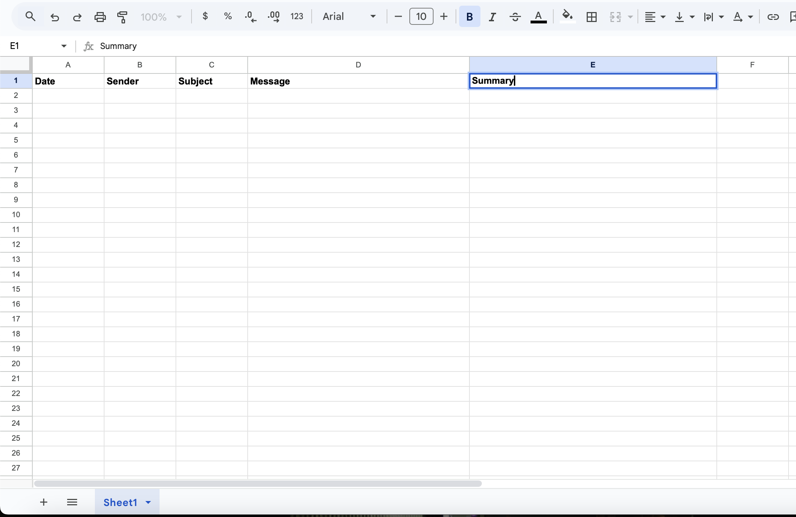
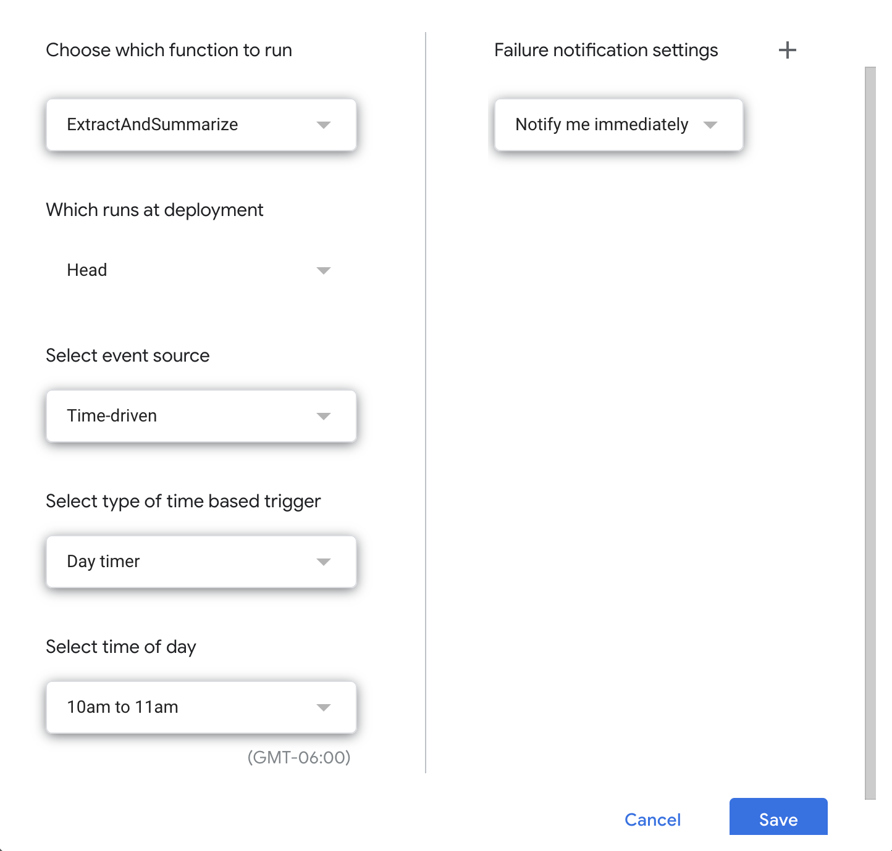
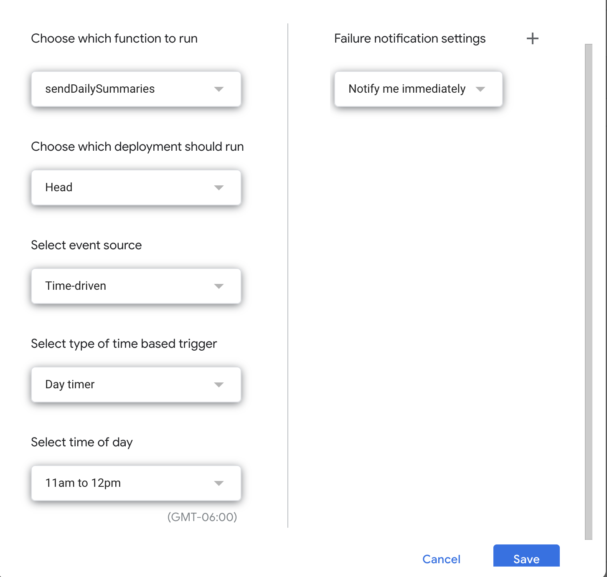

# GmailSummarizer

🌟 **GmailSummarizer** helps you manage your inbox efficiently by summarizing emails and delivering a concise daily digest straight to your inbox. By leveraging Google Apps Script and OpenAI API, this tool automates the process of extracting, summarizing, and emailing key details from your Gmail account.

## 📝 Overview of Steps:
1. **Set up a Google Sheet** to store and organize email summaries.
2. **Use Google Apps Script** to extract emails from your Gmail account and summarize them using the OpenAI API.
3. **Run the scripts manually** or schedule them to run automatically via triggers.
4. Receive a **daily summary email** with key details from your messages.

This tool ensures simplicity and privacy by keeping your data secure within your Google account while utilizing OpenAI API for accurate and concise summarization.

---

## 🚀 Features:
- **Automated Email Summaries**: Parses your Gmail inbox daily to identify key messages and summarize them.
- **Concise Daily Digest**: Sends a single email summarizing your emails from the day, directly to your inbox.
- **Customizable Filters**: Focus on specific email categories, such as work, personal, or promotions, to tailor your summaries.
- **Secure and Private**: Built with privacy in mind, ensuring your email data remains safe.

---

## 🛠️ Setup and Instructions

### **Step 1: Create a Google Sheet**
1. Open Google Sheets and create a new sheet.
2. Create columns in the sheet with the following headers:
   - `Date`
   - `Sender`
   - `Subject`
   - `Message`
   - `Summary`
3. Your Google Sheet should look like this:

   

---

### **Step 2: Add Scripts to Google Apps Script**
1. In your Google Sheet, click on **Extensions > Apps Script**.
2. Add the following two scripts:
   - **`ExtractAndSummarize.gs`**:
     - Extracts emails received after 11 AM the previous day and summarizes them using OpenAI API.
     - Add your OpenAI API key to the script.
   - **`SendSummaryToMe.gs`**:
     - Sends the summarized email details to your inbox.
     - Add your email as the recipient in the script.

---

### **Step 3: Run the Scripts**
1. Verify you have **unread emails** from 11 AM the previous day.
2. Run **`ExtractAndSummarize.gs`**:
   - A security warning will appear. Click **Continue**, then select **Advanced**, and press **Allow** to grant permissions.
3. Run **`SendSummaryToMe.gs`**:
   - Follow the same steps to allow permissions.
4. Check your inbox to confirm the summary email is delivered.

---

### **Step 4: Set Up Triggers**
1. Schedule the scripts to run automatically:
   - Open **Apps Script** and navigate to **Triggers**.
   - Set up the **`ExtractAndSummarize`** function to run daily between **10:00 AM - 11:00 AM**. Use the following reference:

     

   - Set up the **`SendSummaryToMe`** function to run daily between **11:00 AM - 12:00 PM**. Use the following reference:

     

---

## ✅ You're All Set!
Run the scripts manually the first time to test them, and check your inbox for a daily summary email. Enjoy staying organized with GmailSummarizer!
